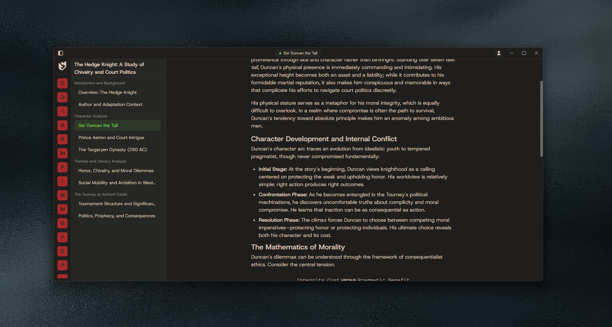

> [!note]
>  journey and i are not in any way affiliated with moodle, this is just a personal project to make the desktop experience a little more tolerable. this is also my first venture into tauri, and (largely) effective rust backends, so a lot of this is still super early/not ideal.

<h2> journey</h2>

Modern desktop client for Moodle course content, prioritises quick access to material and local control. Journey uses Moodle's mobile auth flow for longer-lived sessions, which means your instance **must** have support enabled for the mobile app. The current features include:

- Mobile auth flow for longer lived sessions (permanent tokens)
- Automatic content synchronisation -- module content is stored locally and retrieved/updated in the background to reflect most up to date version of documents
- Aggressive frontend caching on top of local database, meaning virtually no wait times navigating to already visited pages, this allows us to update module content while a cached version is still displayed, then once done, the content is replaced with the newer version. (this is not yet the best implementation, as right now it only returns the content if cached in the webview, otherwise it waits for content to sync before retrieving content from the database, which can lead to unecessary loading times when the content may have already been stored to the database but not yet cached in the webview)
- Ergonomic navigation allows switching between courses and modules within the same layout

# planned

- [ ] course sidebar customisability, change order, colour and icon to more easily identify certain courses
- [ ] latex page content rendering with katex
- [ ] pdf viewer controls for zooming/scaling
- [ ] theming support (dark mode, custom themes)
- [ ] better error handling and reporting
- [ ] more robust syncing, probably means switching to a parallel solution with the use of webview events or tauri's channels
- [ ] indexed module content for course-wide searching
- [ ] support for forum modules